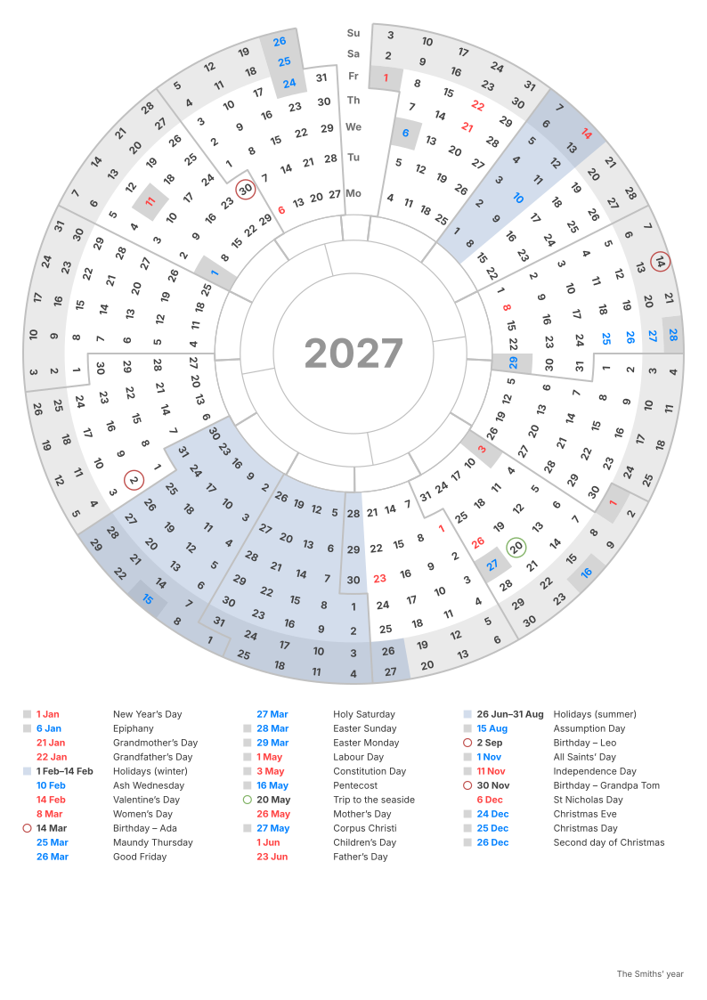

# Round Calendar

*Also available in Polish: [README](README_PL.md)*

A whole year on one A4 sheet, drawn as a disc. Make your own calendar in the browser at
**[bsulkowski.pl/round-calendar](https://bsulkowski.pl/round-calendar)**; this repository holds
the code that draws it.



## The idea

Weeks go round the edge like the hours on a clock, and each weekday is a ring, so all the
Mondays lie on one circle and the weekends make a band along the rim. The rings have equal
areas: the outer ones are thinner but longer. Inside are bands for the seasons (starting on the
real equinoxes and solstices), the zodiac and the months, and the year in the middle. The column
at the top holds the weekday names and marks where the year begins and ends.

Holidays of the Polish calendar can be marked — days off shaded, church days in blue, the others
in red — and so can your own dates: a single day is circled, a range is shaded. Everything with
a name is listed under the disc.

## Settings

A calendar is described by a few lines of plain text: settings (`name: value`) and dates.
Blank lines and lines starting with `#` are ignored; every setting can be left out. Settings
can be written in English or in Polish on either page — only the names on the sheet follow the
language it is drawn in.

| Line | What it does |
|---|---|
| `year: 2027` | The year on the sheet. Without it, the current year. |
| `first day: sun` | The weekday of the innermost ring. Monday by default. |
| `rings: year, seasons, zodiac, months` | The bands inside the weekday rings, from the centre outwards. `year` is the disc in the middle. By default year, seasons and months. |
| `holidays: days off, church, observances` | Holidays of the Polish calendar: public days off, other church days, family days such as Mother’s Day. `pl` means all three. |
| `timezone: +1` | The time zone for the dates of equinoxes and solstices. UTC by default. |
| `14.03 Birthday – Ada` | Your own day, circled and listed. Every year unless a year is given: `14.03.2027` or `2027-03-14`. |
| `26.06-31.08 Holidays` | A range of days, shaded. One that crosses New Year (`20.12-6.01`) shows at both ends of the year. |
| `colors: birthday=#c0504d` | A colour for your dates whose label starts with that word, or for the drawing: `weekend`, `days off`, `church`, `secular`, `own`, `lines`. |
| `title: A.D. 2027` | The text in the middle of the disc instead of the year. |
| `signature: The Smiths’ year` | A line in the bottom-right corner; several lines give several rows. |
| `list: no` | Leaves out the list of named days and centres the disc. |
| `format: 1` | The version of the file format. Saving a file adds it; a file without it is format 1. |

A line that starts with a digit is always a date; one that starts with a letter is always
a setting. Polish keywords: `rok`, `pierwszy dzień`, `pierścienie`, `święta`, `strefa`, `kolory`,
`tytuł`, `podpis`, `lista`.

Ready-made settings and sheets are in [`examples/`](examples): each `.txt` opens on the website
with “Open text file”.

## What is computed

- **Easter** by the Gregorian computus (Meeus/Jones/Butcher), and with it Ash Wednesday, Holy Week,
  Pentecost and Corpus Christi.
- **Equinoxes and solstices** by Meeus, *Astronomical Algorithms*, ch. 27 — within about a minute,
  for years 1583–2999. The date is taken in the time zone from `timezone:`.
- **Weekdays and leap years** for any Gregorian year.
- **Zodiac signs** use the fixed dates printed in calendars.
- **Holidays** are data (`HOLIDAYS`), each with the years it applies (`from`, `until`): Epiphany
  is a day off from 2011, Christmas Eve from 2025. A change in the law is a new entry with `from`,
  so calendars for earlier years stay right.

## Using the code

One TypeScript module, [`src/round-calendar.ts`](src/round-calendar.ts), with no dependencies and
no DOM access. It runs in the browser and in Node ≥ 22.12 (with `--experimental-strip-types`).

```ts
import { parseCalendar, renderCalendar, withFormatLine } from 'round-calendar';
import { EXAMPLE } from 'round-calendar/examples';

const cal = parseCalendar(EXAMPLE.en, 'en', new Date().getFullYear()); // settings, dates, cal.issues
const svg = renderCalendar(cal, 'en');  // <svg …> 210 × 297 mm
withFormatLine(text);                   // the text with a `format: 1` line, as saved to a file
```

`parseCalendar` never throws: lines it cannot read are listed in `cal.issues` with their line
numbers, and the rest is read as usual.

Install from GitHub: `npm install github:bsulkowski/round-calendar`, or with `#<commit>` at the end
to pin a version. The package ships the TypeScript source, so a bundler has to compile it (Vite
does; in an Astro or Vite SSR build, add `round-calendar` to `ssr.noExternal`).

### Compatibility

People keep their settings in text files and in their browsers, so a saved file has to read
the same way later. New features come as new keywords or new kinds of date lines that used to be
errors, never as a new meaning of existing text. The drawing itself may still improve.

Two numbers follow that: `FORMAT_VERSION` changes only if an old file could no longer be read
the same way, and a file from a newer format gets a warning; `TOOL_VERSION` changes with every
release — a new option → 1.1, a fix in the drawing → 1.0.1.

## Tests

```sh
npm test            # dates against published ones, the settings in both languages, every year draws
npm run examples    # redraw examples/
```

## History

The repository began in 2018 as a Groovy script that drew a single year with everything typed
in by hand. The layout — equal-area rings, stepped month borders, colours — comes from there;
it is in the git history.

## Licence

[MIT](LICENSE) — Bartosz Sułkowski.
