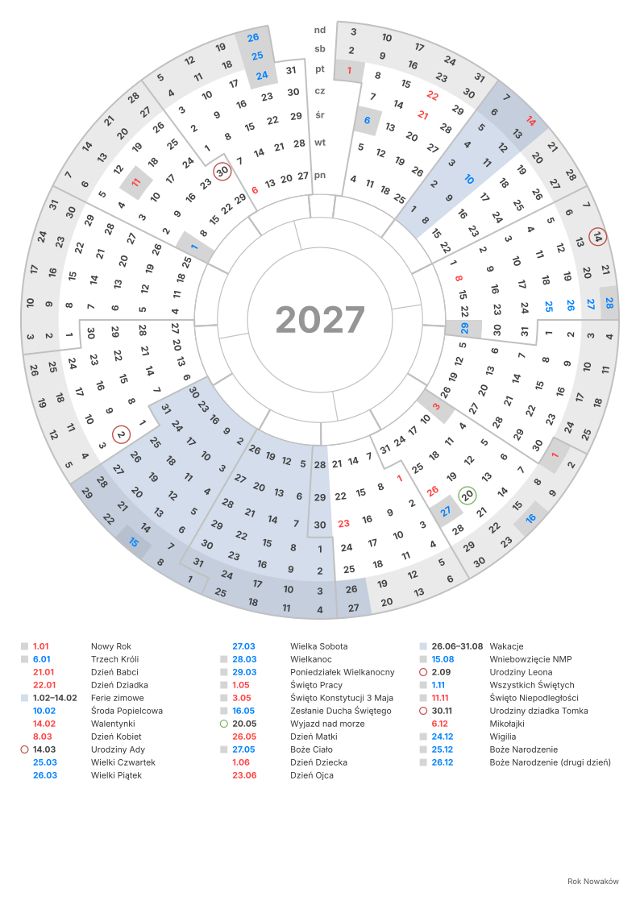

# Okrągły kalendarz

*Dostępne także po angielsku: [README](README.md)*

Cały rok na jednej kartce A4, narysowany jako koło. Własny kalendarz zrobisz w przeglądarce na
**[bsulkowski.pl/pl/round-calendar](https://bsulkowski.pl/pl/round-calendar)**; w tym repozytorium
jest kod, który go rysuje.



## Pomysł

Tygodnie idą po obwodzie jak godziny na tarczy zegara, a każdy dzień tygodnia to pierścień:
wszystkie poniedziałki leżą na jednym okręgu, a weekendy tworzą pas wzdłuż krawędzi. Pierścienie
mają równe pola — zewnętrzne są cieńsze, ale dłuższe. W środku są pasy pór roku (od prawdziwych
równonocy i przesileń), zodiaku i miesięcy, a pośrodku rok. Kolumna u góry mieści nazwy dni
tygodnia i oddziela koniec roku od początku.

Można zaznaczyć święta polskiego kalendarza — dni wolne zacienione, kościelne na niebiesko,
pozostałe na czerwono — i własne daty: pojedynczy dzień dostaje kółko, zakres się zaciemnia.
Wszystko, co ma nazwę, trafia na listę pod kołem.

## Ustawienia

Kalendarz opisuje kilka linijek zwykłego tekstu: ustawienia (`nazwa: wartość`) i daty.
Puste linie i linie zaczynające się od `#` są pomijane; każde ustawienie można pominąć.
Ustawienia można pisać po polsku albo po angielsku — od języka rysunku zależą tylko nazwy
na kartce.

| Linia | Co robi |
|---|---|
| `rok: 2027` | Rok na kartce. Bez tej linii — bieżący. |
| `pierwszy dzień: nd` | Dzień tygodnia na najbardziej wewnętrznym pierścieniu. Domyślnie poniedziałek. |
| `pierścienie: rok, pory roku, zodiak, miesiące` | Pasy wewnątrz pierścieni dni, od środka na zewnątrz. `rok` to koło pośrodku. Domyślnie rok, pory roku i miesiące. |
| `święta: wolne, kościelne, okolicznościowe` | Święta polskiego kalendarza: dni ustawowo wolne, pozostałe kościelne, rodzinne jak Dzień Matki. `pl` oznacza wszystkie trzy. |
| `strefa: +1` | Strefa czasowa dla dat równonocy i przesileń. Domyślnie UTC. |
| `14.03 Urodziny Ady` | Twój dzień, z kółkiem i na liście. Co roku, chyba że podasz rok: `14.03.2027` albo `2027-03-14`. |
| `26.06-31.08 Wakacje` | Zakres dni, zacieniony. Zakres przez Nowy Rok (`20.12-6.01`) pojawia się na obu końcach roku. |
| `kolory: urodziny=#c0504d` | Kolor Twoich dat, których etykieta zaczyna się od tego słowa, albo rysunku: `weekend`, `wolne`, `kościelne`, `świeckie`, `własne`, `linie`. |
| `tytuł: A.D. 2027` | Napis w środku koła zamiast numeru roku. |
| `podpis: Rok Nowaków` | Linijka w prawym dolnym rogu; kilka linii to kilka wierszy. |
| `lista: nie` | Pomija listę nazwanych dni i ustawia koło na środku. |
| `format: 1` | Wersja formatu pliku. Zapis do pliku ją dodaje; plik bez niej to format 1. |

Linia zaczynająca się od cyfry to zawsze data, od litery — zawsze ustawienie. Angielskie słowa
kluczowe: `year`, `first day`, `rings`, `holidays`, `timezone`, `colors`, `title`, `signature`, `list`.

Gotowe ustawienia i arkusze są w [`examples/`](examples): każdy plik `.txt` otwiera się na stronie
przyciskiem „Otwórz plik tekstowy”.

## Co jest liczone

- **Wielkanoc** algorytmem gregoriańskim (Meeus/Jones/Butcher), a z nią Popielec, Wielki Tydzień,
  Zesłanie Ducha Świętego i Boże Ciało.
- **Równonoce i przesilenia** według Meeusa, *Astronomical Algorithms*, rozdz. 27 — z dokładnością
  do około minuty, dla lat 1583–2999. Datę bierze się w strefie z `strefa:`.
- **Dni tygodnia i lata przestępne** dla dowolnego roku kalendarza gregoriańskiego.
- **Znaki zodiaku** mają stałe daty, jak w drukowanych kalendarzach.
- **Święta** to dane (`HOLIDAYS`), każde z latami obowiązywania (`from`, `until`): Trzech Króli jest
  wolne od 2011, Wigilia od 2025. Zmiana prawa to nowy wpis z `from`, więc kalendarze na wcześniejsze
  lata zostają poprawne.

## Użycie kodu

Jeden moduł TypeScript, [`src/round-calendar.ts`](src/round-calendar.ts), bez zależności i bez
dostępu do DOM. Działa w przeglądarce i w Node ≥ 22.12 (z `--experimental-strip-types`).

```ts
import { parseCalendar, renderCalendar, withFormatLine } from 'round-calendar';
import { EXAMPLE } from 'round-calendar/examples';

const cal = parseCalendar(EXAMPLE.pl, 'pl', new Date().getFullYear()); // ustawienia, daty, cal.issues
const svg = renderCalendar(cal, 'pl');  // <svg …> 210 × 297 mm
withFormatLine(text);                   // tekst z linią `format: 1`, tak jak przy zapisie do pliku
```

`parseCalendar` nie rzuca wyjątków: linie, których nie umie przeczytać, trafiają do `cal.issues`
z numerami, a reszta czyta się normalnie.

Instalacja z GitHuba: `npm install github:bsulkowski/round-calendar`, albo z `#<commit>` na końcu,
żeby przypiąć wersję. Paczka zawiera źródło TypeScript, więc musi je skompilować bundler (Vite
to robi; w buildzie SSR Astro albo Vite dodaj `round-calendar` do `ssr.noExternal`).

### Zgodność

Ustawienia trzyma się w plikach tekstowych i w przeglądarkach, więc zapisany plik musi później
czytać się tak samo. Nowe funkcje przychodzą jako nowe słowa kluczowe albo nowe kształty linii
z datą, które dotąd dawały błąd — nigdy jako nowe znaczenie istniejącego tekstu. Sam rysunek
może się poprawiać.

Pilnują tego dwa numery: `FORMAT_VERSION` rośnie tylko wtedy, gdy stary plik przestałby się
czytać tak samo, a plik w nowszym formacie dostaje ostrzeżenie; `TOOL_VERSION` zmienia się
z każdym wydaniem — nowa opcja → 1.1, poprawka rysunku → 1.0.1.

## Testy

```sh
npm test            # daty vs. opublikowane, ustawienia w obu językach, rysowanie każdego roku
npm run examples    # przerysowanie examples/
```

## Historia

Repozytorium powstało w 2018 roku jako skrypt w Groovym, który rysował jeden rok z wszystkim
wpisanym ręcznie. Stamtąd pochodzi układ — pierścienie o równych polach, schodkowe granice
miesięcy, kolory; stary kod jest w historii gita.

## Licencja

[MIT](LICENSE) — Bartosz Sułkowski.
